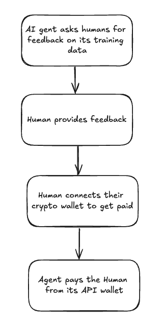

# Coinbase-SDK - AI Feedback Tool 

AI Feedback tool is a simple application built with [Coinbase SDK](https://docs.cdp.coinbase.com/coinbase-sdk/docs/welcome). The application shows how to create an [MPC wallet](https://docs.cdp.coinbase.com/mpc-wallet/docs/welcome), fund the wallet, and transfer eth on Base-Sepolia network to a recipient.

[Demo](docs/videos/aiwallet-demo.mp4)



## Getting Started
To start, [create a CDP API Key](https://portal.cdp.coinbase.com/access/api). Then, create a `.env` file in the root directory with the following content:

```text
NAME="YOUR_API_KEY_NAME"
PRIVATE_KEY="YOUR_API_KEY_PRIVATE"
WALLET_DATA={ "WALLET_ID": { "seed": "", "encrypted": false, "authTag": "", "iv": "" } }
```

`WALLET_DATA` is optional. If you don't have a wallet, you can remove the `WALLET_DATA` field. 
If you have a wallet, make sure the wallet you are using is funded before running the application.

Install the dependencies:
```bash
npm install
# or
yarn
```

Then, run the development server:
```bash
npm run dev
# or
yarn dev
```

Open [http://localhost:3000](http://localhost:3000) with your browser to use the application.

## Learn More
To learn more about the Coinbase SDK, take a look at the following resources:

- [Coinbase CDP](https://portal.cdp.coinbase.com/access/api) - Coinbase Developer Portal.
- [Platform APIs Documentation](https://docs.cdp.coinbase.com/coinbase-sdk/docs/quickstart) - Coinbase SDK Documentation.

## Deploy on Vercel

The easiest way to deploy this app is to use Vercel. Click the button below to deploy your own copy of the AI Feedback tool:
[](https://vercel.com/new/clone?repository-url=https%3A%2F%2Fgithub.com%2Fcoinbase%2Fcoinbase-sdk-ai-agent-sample&env=PRIVATE_KEY,NAME&envDescription=PRIVATE_KEY%20and%20NAME%20are%20the%20API%20key%20and%20name%20of%20the%20key%20you%20download%20from%20Coinbase%20Developer%20Platform%20portal.&envLink=https%3A%2F%2Fdocs.cdp.coinbase.com%2Fdeveloper-platform%2Fdocs%2Fcdp-keys&project-name=ai-wallet-coinbase-sdk&repository-name=ai-wallet-coinbase-sdk)

## References

The images in the demo are sourced from [Unsplash](https://unsplash.com/).